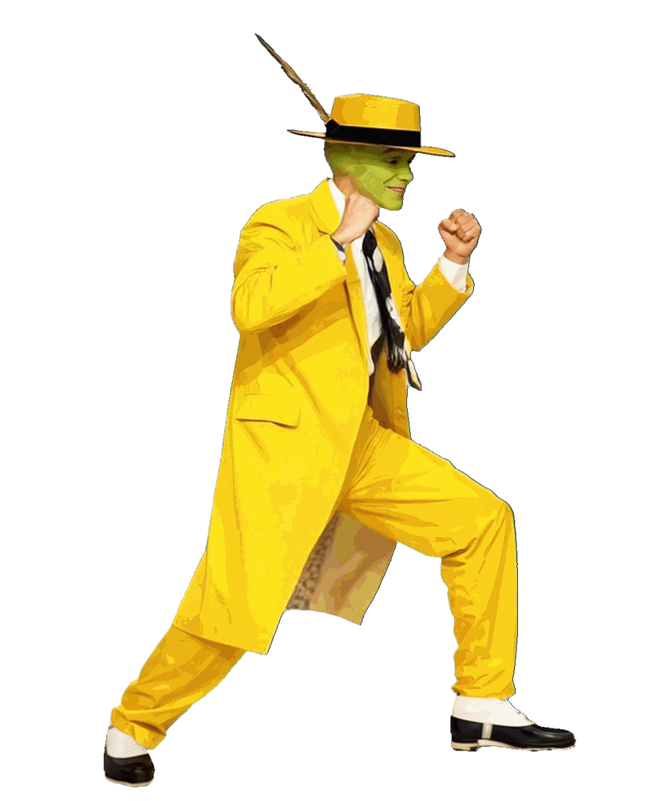

# The Mask (1994)

---

## Información

- **Personaje:** The Mask  
- **Origen:** Película *The Mask* (1994)  
- **Personaje interpretado por:** Jim Carrey  
- **Autor del proyecto:** Mugen's World  
- **Estado:** En desarrollo (etapa muy temprana)

---

## Descripción

Este proyecto busca recrear a **The Mask**, el personaje de la película *The Mask (1994)*, como un personaje jugable para **MUGEN**.

El desarrollo del personaje se encuentra actualmente **en una etapa muy inicial**, por lo que muchas animaciones, habilidades y mecánicas aún están en proceso de creación.

Actualmente el trabajo se está enfocando en la creación de **los sprites base**, comenzando por la animación de **stand** del personaje.

---

## Desarrollo

Los sprites del personaje están siendo **creados desde cero** utilizando herramientas de IA y procesos de animación.

El proceso general incluye:

1. Creación de sprites base
2. Generación de animaciones
3. Conversión de animaciones a frames
4. Conversión final a sprites BMP compatibles con MUGEN

Herramientas utilizadas durante el proceso:

- ChatGPT
- Grok
- Gemini
- A2E
- Vidu
- Herramientas de extracción de frames

---

## Base del código

Este proyecto está siendo desarrollado desde cero, aunque es posible que en el futuro se utilice **código derivado de otros personajes existentes de MUGEN** para implementar ciertas mecánicas o sistemas de combate.

Si se utilizan recursos de otros autores, los créditos correspondientes serán añadidos aquí.

---

## Créditos

**Autor del proyecto**

- Mugen's World

---

## Estado del proyecto

🚧 Proyecto en desarrollo temprano

Actualmente el personaje se encuentra **en una fase muy inicial**, incluyendo:

- Creación de sprites
- Animación base (stand)
- Desarrollo de movimientos
- Implementación de mecánicas

---

## Filosofía del proyecto

Este proyecto sigue el espíritu de la comunidad **MUGEN**:

> MUGEN es de la comunidad para la comunidad.

---

## Uso y distribución

Este proyecto es completamente libre para la comunidad.

Se permite:

- Usar el personaje
- Modificarlo
- Crear versiones derivadas
- Usar los sprites
- Integrarlo en otros proyectos

No existen restricciones de uso.

Bajo ninguna circunstancia este contenido debe venderse.

---

## Futuro del proyecto

Planes para el personaje:

- Desarrollo completo de animaciones
- Movimientos especiales inspirados en la película
- Animaciones exageradas estilo cartoon
- Posibles transformaciones y ataques cómicos
